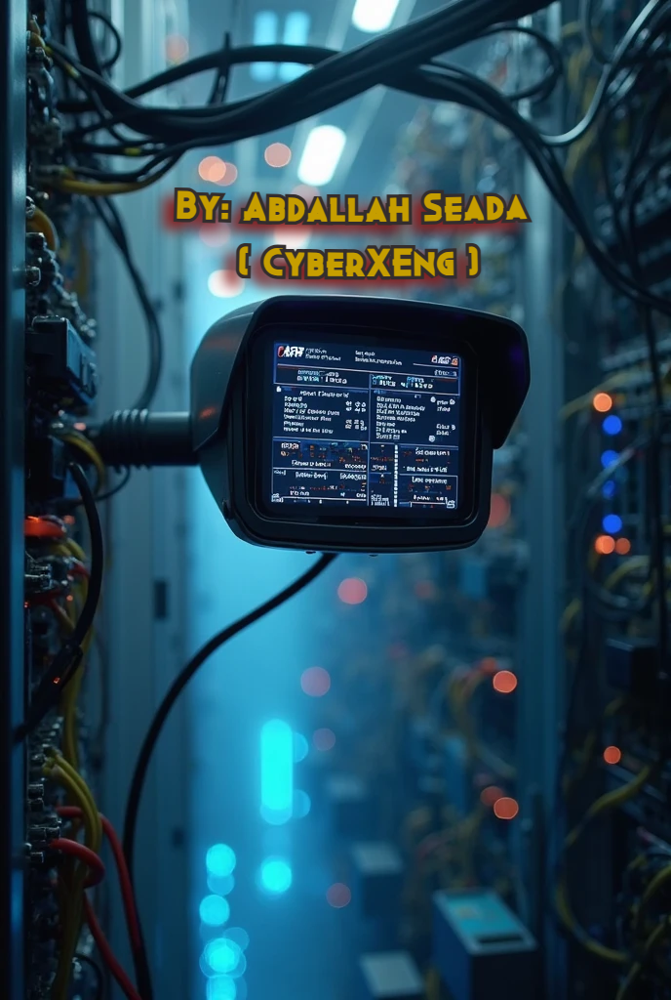

# Installation
Install all required libraries from the `requirements.txt` file using:  
`pip install -r requirements.txt`

# Description 
The Semi Control Board is a multifunctional application designed for efficient file and folder management with built-in security features and an integrated text editor. Whether you’re organizing files, protecting sensitive data, or editing documents, this program offers a balanced combination of practicality, control, and usability. 
 
## 🔑 Core Features: 

### 1-) Encryption (Symmetric & Asymmetric)
Protect sensitive files and folders using symmetric encryption (e.g., AES) for speed or asymmetric encryption (e.g., RSA) for enhanced security. Ideal for securing personal or confidential data.

### 2-) Decryption 
Seamlessly decrypt files and folders previously encrypted by the tool, restoring full access while maintaining data integrity.

### 3-) File Deletion 
Permanently delete unwanted files to keep your workspace clean and organized.

### 4-) File Renaming 
Rename files with ease for better structure, clarity, or version control.

### 5-) Move Folders 
Relocate folders to different directories with minimal effort to improve your data organization.

### 6-) List Files in Folder 
Quickly list and view the contents of any folder to manage files effectively.

### 7-) Integrated Text Editor
Create, view, and edit text files directly within the program. Ideal for writing notes, editing scripts, or modifying config files—without needing an external editor.
